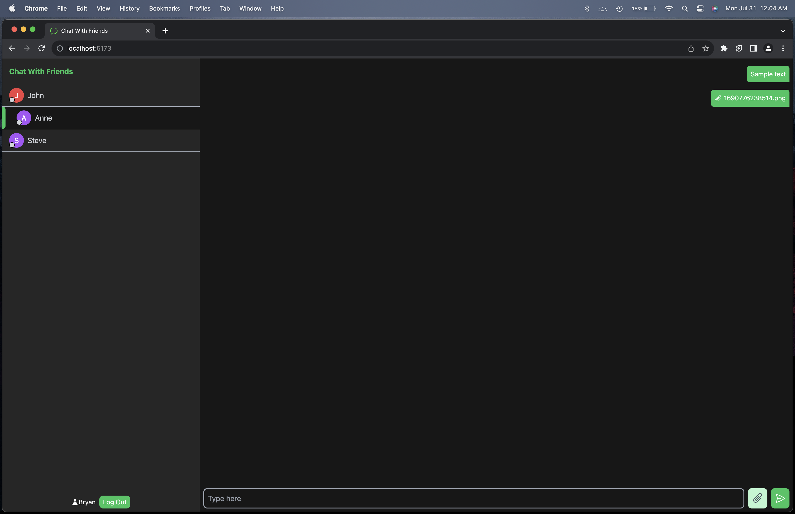

# Chat With Friends

A chat app for simple texts and images, written using the MERN (MongoDB, Express, React, Node), employing WebSockets. Uses JWTs for user authentication. Other tools/packages used include Vite, TailWindCSS, cookie-parser.

MongoDB - Users                         |MongoDB - Messages
:--------------------------------------:|:--------------------------------------:
|

Client - Uploading Image                |Client - Sending Texts
:--------------------------------------:|:--------------------------------------:
|

Log In                                  |Register
:--------------------------------------:|:--------------------------------------:
|

## To-Do
- [ ] Add chatrooms for multiple users
- [ ] Add functionality to request to chat before chat opens
- [ ] Refactor codebase for integration into [MealsWithFriends](https://github.com/bryanwsebaraj/MealsWithFriends_backend)

## Testing
### Start API
 - Navigate to /api
 - Create .env file with appropriate credentials for:
	- `MONGO_URL, JWT_SECRET, CLIENT_URL`
 - run 'node index.js'

### Start Client
 - Navigate to /client
 - run 'npm run dev'